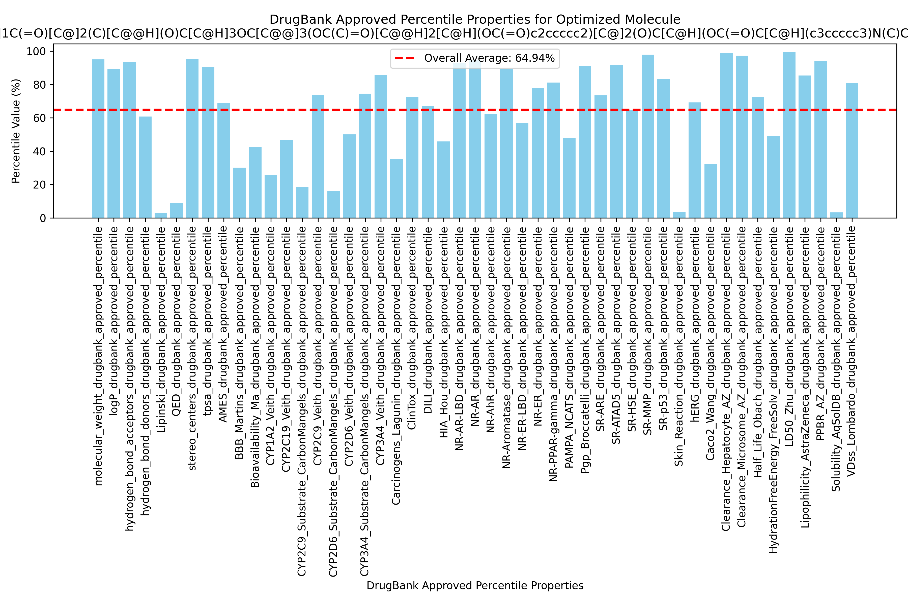
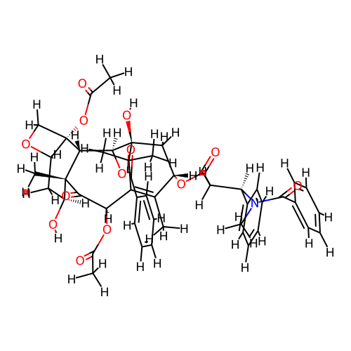
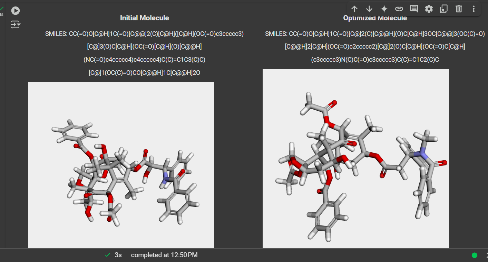

# LigandXplore: A Computational Pipeline for Early-Stage Drug Discovery


LigandXplore is a Python-based cheminformatics pipeline that leverages a genetic algorithm (GA) to optimize the properties of drug-like molecules, specifically focusing on ADMET (Absorption, Distribution, Metabolism, Excretion, Toxicity) properties.  This project empowers researchers to efficiently explore and refine potential drug candidates by automatically evolving molecular structures towards improved characteristics.  Users input a starting SMILES string for their ligand and select a target ADMET property from a provided list to optimize.  The GA then explores the chemical space around the initial ligand, applying various mutation operators, evaluating the fitness of each mutated molecule based on the chosen ADMET property prediction, and iteratively evolving a population of ligands. The results of the mutation process, including the operator used, the mutated SMILES, and the predicted property value, are stored in a CSV file for further analysis.

## Motivation 🤔

Drug discovery and development is a complex and resource-intensive process.  Optimizing lead compounds for desired ADMET properties is a crucial, yet often time-consuming, step. LigandXplore aims to accelerate this process by providing a tool that automates the exploration and optimization of molecular structures.  By using a genetic algorithm, LigandXplore can efficiently search a vast chemical space, identify promising candidates, and reduce the reliance on manual, trial-and-error approaches.  This project was developed to provide researchers with a readily accessible and customizable pipeline for lead optimization.

## Key Features 🌟

* **ADMET Property Prediction:** Integrates with the `admet_ai` library to predict key ADMET properties.
* **User-Defined Target Property:** Allows users to select the specific ADMET property they wish to optimize from a provided list.
* **Genetic Algorithm-Based Optimization:** Employs a GA to efficiently explore the chemical space and evolve ligands towards improved target properties.
* **Diverse Mutation Operators:** Implements a variety of mutation operators, including atom deletion, insertion, bond order modification, substructure replacement, ring modification, atom swapping, and stereochemistry alteration, to generate diverse molecular structures.
* **Mutation Tracking:**  Records all mutations performed during the GA process, including the operator used, the resulting SMILES string, and the predicted property value, in a CSV file for detailed analysis.
* **3D Visualization:**  Display 3D conformations of initial and optimized molecules.
* **Output Files:** Save ligands as SDF files, PNG images, and CSV files with ADMET data.
* **Graphical Representation:** Visualize drug-likeness percentiles and other key ADMET properties.
* **Open-Source and Customizable:**  The project is open-source and designed to be easily adaptable to specific research needs.

## Installation Instructions ⬇️

1. **Clone the Repository:**
   ```bash
   git clone [https://github.com/AkshayAbraham/LigandXplore.git](https://www.google.com/search?q=https://github.com/AkshayAbraham/LigandXplore.git)  # Replace with your repo URL
   cd LigandXplore

  2. **Create a Virtual Environment (Recommended):**
     ```bash
     python3 -m venv .venv  # Create a virtual environment
     source .venv/bin/activate  # Activate the environment (Linux/macOS)
     .venv\Scripts\activate  # Activate the environment (Windows)

  3. **Install Dependencies:**
     ```bash
     pip install rdkit
     pip install admet-ai
     pip install tabulate
     pip install --upgrade pandas
     pip install rdkit admet-ai pandas scikit-learn deap
     pip install py3Dmol ipywidgets

 ### Run on Google Colab 
 Upload the project to your Google Drive and open the Colab notebook to execute all steps.

 You can view this project in Google Colab using the following link:

[Open in Colab](https://colab.research.google.com/drive/1juFyMdiQqhImjCvr1pLvu9v1NpxeLUKo?usp=sharing) 

 ### Usage Instructions
- Run the Colab Notebook: Open LigandXplorer_notebook.ipynb in Google Colab.

- Upload Ligand Files: Users can upload ligands in .sdf files, and the program will predict all ADMET properties.

- Rank Ligands: The program will rank all ligands based on drug-likeness after ADMET prediction.
  
- Input SMILES String: Provide an initial ligand structure using a SMILES string.
  
- Run Genetic Algorithm: Execute the optimization steps to mutate and refine the ligand.

- View Molecules: Visualize the initial and optimized ligands in 3D.

- Predict ADMET: Run ADMET prediction on the optimized ligand and visualize the results.

- Save Outputs: Export the ligand structure as SDF and PNG files, and save ADMET data as CSV.

- Predict ADMET: Run ADMET prediction on the optimized ligand and visualize the results.

- Save Outputs: Export the ligand structure as SDF and PNG files, and save ADMET data as CSV.

  (*Users can optimize any ADMET property defined in `admet_properties.txt`*)

## Technologies Used 💻
- 👨🏻‍💻RDKit – For molecular representations and cheminformatics.
- 👨🏻‍💻admet-ai – For ADMET (Absorption, Distribution, Metabolism, Excretion, Toxicity) predictions.
- 👨🏻‍💻pandas – For data handling and analysis.
- 👨🏻‍💻tabulate – For displaying structured tables.
- 👨🏻‍💻scikit-learn – For machine learning.
- 👨🏻‍💻DEAP – For evolutionary optimization and molecule enhancement.
- 👨🏻‍💻py3Dmol & ipywidgets – For interactive 3D molecular visualization.

## License ⚖️

This project is licensed under the MIT License.

## Future Scope 🔭

This project serves as a starting point for ligand optimization and can be improved in numerous ways:

1. Implementing advanced mutation operators for more effective ligand mutations.

2. Integrating machine learning models to guide the genetic algorithm for better optimization.

3. Enhancing the ADMET prediction pipeline with more comprehensive datasets.

4. Adding support for more molecular file formats and visualization tools.

5. Expanding the scoring mechanism to consider more pharmacokinetic and pharmacodynamic properties.

The project lays the foundation for more sophisticated ligand design and optimization workflows in bioinformatics and cheminformatics.


## Results 📜

This section presents examples of the outputs generated by LigandXplore, showcasing its ability to predict ADMET properties, track mutation results, and visualize optimized molecules.  These examples illustrate the pipeline's functionality and the type of information it provides to researchers.

### ADMET Prediction Graph generated for the Optimized Molecule



This graph displays the predicted ADMET properties the optimized molecule. It assesses the drug-likeness probability based on percentile scores of DrugBank-approved molecules. The specific ADMET properties shown on the graph (e.g., Lipophilicity, logD, etc.) are determined by the `admet_ai` library and can be customized by the user through the `admet_properties.txt` file.  This visualization helps to assess the Overall drug-likeness probability of the ligand. As shown in the graph Overall drug-likeness probability (average) of the optimized molecule is 64.94%. 

Along with that the ADMET propert of all the mutated molecules is listed in the table [View Mutation Results CSV](Results/generated_molecules_admet.csv)


### Mutation Results

[View Mutation Results CSV](Results/mutation_results.csv)

This table illustrates a typical output during the mutation phase of the genetic algorithm. It shows a selection of the mutations performed, including the specific mutation operator applied (e.g., Atom Deletion, Bond Order Modification), the SMILES string of the resulting mutated molecule, and the predicted value of the target ADMET property for that molecule.  This table offers insight into how the GA explores the chemical space, highlighting the types of structural changes that influence the target property.  The full mutation data, including all mutations and their corresponding properties, is stored in the `generated_molecules_admet.csv` file within the `results` directory.

### Optimized Molecule Visualization




This image displays the 3D structure of the optimized molecule and initial generated by LigandXplore.  Visualizing and comparing the optimized structure and initial structure is crucial for understanding the structural changes that occurred during the optimization process.  Users can interact with and further explore the 3D structure using molecular visualization software (e.g., PyMOL, Jmol, or within Colab using libraries like py3Dmol). The `optimized_molecule (1).sdf` file of the optmized molecule is added in the `results` directory for which helps in the further analysis

## Conclusion ✍
LigandXplore provides a valuable computational tool for researchers in the early stages of drug discovery. By automating the optimization of lead compounds for key ADMET properties, it accelerates the process of identifying promising drug candidates. The combination of genetic algorithm-based optimization, ADMET prediction, and interactive visualization allows researchers to efficiently explore the chemical space and make informed decisions about molecular design.  While this project represents a significant step towards streamlined ligand optimization, the future scope outlined above highlights areas for continued development and enhancement, promising even more powerful tools for drug discovery in the future.  We encourage researchers to use, adapt, and contribute to LigandXplore to further advance the field of cheminformatics.

